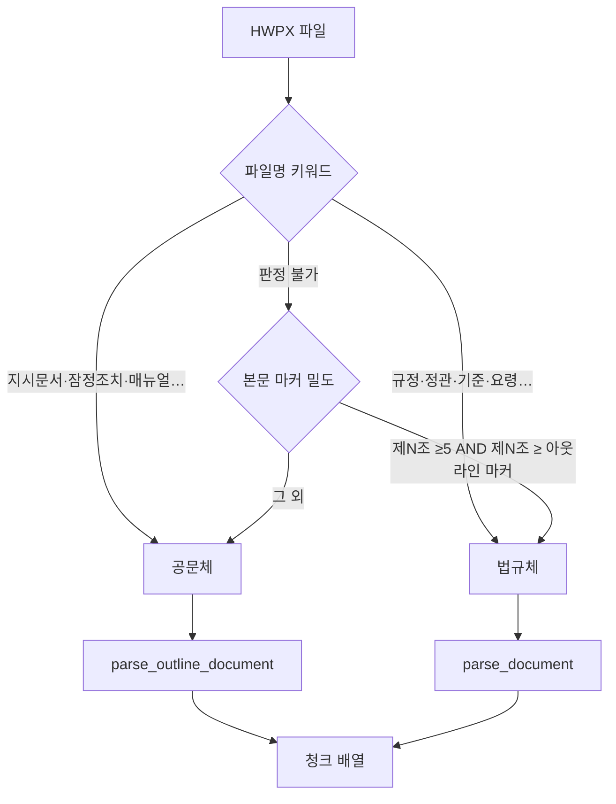
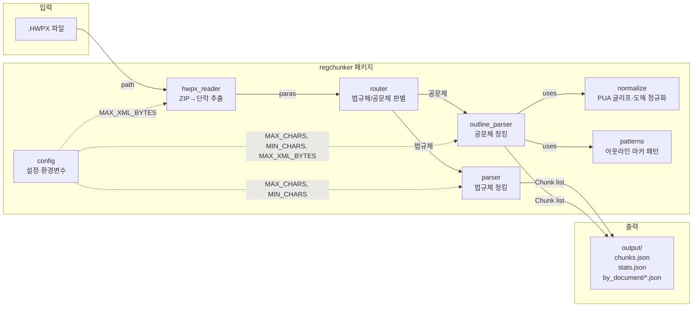

# hwpx_chunker — 사용 가이드

한국어 HWPX 규정·공문 문서를 **조문(법규체) / 아웃라인 절(공문체)** 단위로 자동 청킹하여 JSON으로 출력하는 파이프라인입니다.

---

## 목차

1. [요구 사항](#요구-사항)
2. [설치](#설치)
3. [설정](#설정)
4. [실행 방법](#실행-방법)
5. [출력 구조](#출력-구조)
6. [청크 필드 레퍼런스](#청크-필드-레퍼런스)
7. [문서 유형 판별 로직](#문서-유형-판별-로직)
8. [아키텍처](#아키텍처)
9. [자주 묻는 질문](#자주-묻는-질문)

---

## 요구 사항

| 항목 | 버전 |
|------|------|
| Python | ≥ 3.9 |
| 외부 의존성 | **없음** (표준 라이브러리만 사용) |
| 입력 형식 | `.HWPX` (한글 2010 이상) |

---

## 설치

```bash
# 1. 저장소 클론
git clone <repo-url> hwpx_chunker
cd hwpx_chunker

# 2. (선택) 가상환경 생성
python -m venv .venv
# Windows
.venv\Scripts\activate
# macOS / Linux
source .venv/bin/activate

# 3. 런타임 의존성 설치 (없음 — 표준 라이브러리만 사용)
pip install -r requirements.txt     # 내용 없음, 확인용

# 4. (선택) 개발 도구 설치
pip install -r requirements-dev.txt  # pytest, mypy, black, ruff
# 또는 pyproject.toml 통합 설치
pip install -e ".[dev]"
```

> 런타임 외부 패키지가 없으므로 가상환경 없이 `python main.py`만으로도 즉시 동작합니다.

---

## 설정

### 환경변수 (우선 적용)

| 환경변수 | 기본값 | 설명 |
|----------|--------|------|
| `HWPX_INPUT_DIR` | `~/Downloads` | HWPX 파일이 있는 폴더 |
| `HWPX_OUTPUT_DIR` | `<프로젝트루트>/output` | 결과 JSON 출력 폴더 |
| `HWPX_MAX_CHARS` | `1400` | 청크 최대 글자 수 |
| `HWPX_MIN_CHARS` | `30` | 청크 최소 글자 수 (미만 제거) |
| `HWPX_MAX_XML_BYTES` | `52428800` (50 MB) | 섹션 XML 최대 크기 (ZIP 폭탄 방어) |

**예시 — 폴더·패턴 재정의:**

```bash
# Windows (PowerShell)
$env:HWPX_INPUT_DIR = "D:\regulations"
$env:HWPX_INPUT_GLOB = "*.HWPX"
python main.py

# macOS / Linux
HWPX_INPUT_DIR=/data/regs HWPX_INPUT_GLOB="*.HWPX" python main.py
```

### `regchunker/config.py` 직접 수정

환경변수 없이 기본값만 바꿀 때는 `config.py`의 `_DEFAULT_INPUT` 부분을 수정합니다.

---

## 실행 방법

### 기본 실행 (기본 폴더·패턴 사용)

```bash
python main.py
```

### 폴더 지정

```bash
python main.py D:\regulations
```

### 파일 직접 지정 (여러 개 가능)

```bash
python main.py "D:\regs\규정A.HWPX" "D:\regs\규정B.HWPX"
```

### 파일 패턴 직접 지정 (기본 glob 우회)

```bash
# 특정 패턴만 처리
python main.py "D:\regs\*.HWPX"

# 기본 INPUT_GLOB 자체를 바꾸려면 config.py의 INPUT_GLOB 상수를 직접 수정
```

### 상세 로그 출력 (`--verbose` / `-v`)

```bash
python main.py --verbose D:\regulations
```

상세 모드에서는 각 파일의 단락 수, 라우팅 결과, 처리 시간을 추가로 출력합니다.

---

## 출력 구조

```
output/
├── chunks.json               ← 전체 청크 배열 (모든 문서 합산)
├── stats.json                ← 통계 요약
└── by_document/
    ├── <doc_id_A>.json       ← 문서별 청크 배열
    └── <doc_id_B>.json
```

### `stats.json` 예시

```json
{
  "n_documents": 5,
  "n_ok": 5,
  "n_errors": 0,
  "n_chunks_total": 245,
  "by_unit": { "연혁": 5, "조": 132, "부칙": 108 },
  "by_document": { "문서A": 37, "문서B": 23 },
  "documents": [ ... ],
  "errors": []
}
```

---

## 청크 필드 레퍼런스

각 청크는 `Chunk` 데이터클래스를 딕셔너리로 직렬화한 것입니다.

### 공통 필드

| 필드 | 타입 | 설명 |
|------|------|------|
| `chunk_id` | `str` | 고유 ID (`doc_id::article_label::split_index`) |
| `doc_id` | `str` | 문서 ID (파일명 기반, 특수문자 정제) |
| `doc_title` | `str` | 문서 제목 (보안 레이블 제외 후 첫 단락) |
| `doc_type` | `str` | 규정 유형 (`정관` / `규정` / `기준` / … / `기타`) |
| `source_file` | `str` | 원본 파일명 |
| `doc_family` | `str` | `법규체` 또는 `공문체` |
| `unit` | `str` | 청크 단위 (아래 표 참고) |
| `enacted` | `str` | 제정일 텍스트 |
| `last_amended` | `str` | 최종 개정일 텍스트 |
| `hierarchy_path` | `str` | 계층 경로 (`제1장 > 제3조` 형식) |
| `article_label` | `str` | 청크 레이블 (`제5조`, `Ⅱ. 보증 절차`, …) |
| `article_title` | `str` | 청크 제목 |
| `has_table` | `bool` | 표 흔적 포함 여부 |
| `has_figure` | `bool` | 도해·플로우차트 흔적 포함 여부 |
| `has_appendix_ref` | `bool` | 붙임·별표 참조 포함 여부 |
| `amendment_dates` | `list[str]` | 청크 내 개정일 목록 |
| `split_index` | `int` | 분할 순번 (0-based) |
| `split_total` | `int` | 전체 분할 수 |
| `char_len` | `int` | 텍스트 글자 수 |
| `text` | `str` | 청크 본문 |

### `unit` 값 목록

| unit | 문서 패밀리 | 설명 |
|------|-------------|------|
| `연혁` | 법규체 | 제목 + 제정·개정 이력 |
| `조` | 법규체 | 조문 (제N조) |
| `부칙` | 법규체 | 부칙 블록 |
| `헤더` | 공문체 | 수신·발신·시달문 등 프런트매터 |
| `본문` | 공문체 | 아웃라인 최상위 절 |
| `붙임` | 공문체 | 붙임·별첨 블록 |
| `목차` | 공문체 | 목차 (검색 제외 권장) |

### 법규체 전용 필드

| 필드 | 타입 | 설명 |
|------|------|------|
| `chapter_no` / `chapter_title` | `str` | 장 번호·제목 |
| `section_no` / `section_title` | `str` | 절 번호·제목 |
| `article_no` | `str` | 조 번호 |
| `article_branch` | `str` | 가지조문 번호 (`의N`) |
| `is_deleted` | `bool` | 삭제 조문 여부 |

### 공문체 전용 필드

| 필드 | 타입 | 설명 |
|------|------|------|
| `recipient` | `str` | 수신처 |
| `sender` | `str` | 발신명의 |

---

## 문서 유형 판별 로직



---

## 아키텍처



### 모듈 역할

| 모듈 | 역할 |
|------|------|
| `hwpx_reader.py` | ZIP 열기 → `section*.xml` → `<hp:p>` 단락 텍스트 추출 |
| `router.py` | 파일명 키워드 → 밀도 보조 → `법규체`/`공문체` 결정 |
| `parser.py` | 법규체: 장·절·조·부칙 단위 청킹, `Chunk` 데이터클래스 정의 |
| `outline_parser.py` | 공문체: 프런트매터→목차→본문(아웃라인)→붙임 청킹 |
| `patterns.py` | 아웃라인 마커 정규식 및 공문 골격 패턴 공유 |
| `normalize.py` | PUA 글리프 제거, 세로쓰기 재조립, 원문자 번호 정렬 |
| `config.py` | 환경변수 우선·상수 정의 (`MAX_CHARS`, `MIN_CHARS`, `MAX_XML_BYTES`) |

---

## 자주 묻는 질문

### Q. `[!] 입력 파일을 찾지 못했습니다` 오류

`HWPX_INPUT_DIR`와 `HWPX_INPUT_GLOB` 환경변수 또는 CLI 인자로 경로를 명시하세요.

```bash
python main.py "C:\Users\me\Downloads"
```

### Q. 특정 파일이 `공문체`로 잘못 분류됩니다

`router.py`의 `_LAW_KEYWORDS` / `_DOC_KEYWORDS` 리스트에 해당 키워드를 추가하거나,
파일명 앞부분에 `규정_`·`기준_` 접두어를 붙이면 법규체로 우선 분류됩니다.

### Q. 청크가 너무 많이/적게 나옵니다

`HWPX_MAX_CHARS` 값을 늘리면 청크가 줄고, 줄이면 청크가 늘어납니다.

```bash
HWPX_MAX_CHARS=2000 python main.py
```

### Q. `목차` 청크를 벡터 검색에서 제외하고 싶습니다

`unit == "목차"` 조건으로 필터링하세요.

```python
search_chunks = [c for c in chunks if c["unit"] != "목차"]
```

### Q. `doc_id`가 너무 깁니다

`make_doc_id()`는 파일명 기반으로 ID를 생성합니다. 원본 파일명이 짧을수록 ID도 짧아집니다.
필요하면 `parser.py`의 `make_doc_id()` 함수를 수정해 UUID로 교체할 수 있습니다.

### Q. 표·도해가 포함된 청크만 따로 가져오려면?

```python
table_chunks  = [c for c in chunks if c["has_table"]]
figure_chunks = [c for c in chunks if c["has_figure"]]
```

---

*generated with [Claude Code](https://claude.ai/code) · hwpx_chunker v0.1.0*
